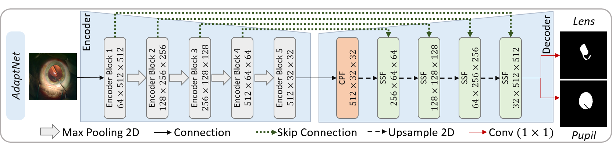

# AdaptNet-MICCAI2021
This repository provides the official PyTorch implementation of AdaptNet (Shape/Scale Adaptive U-Net).

AdaptNet is initially proposed for semantic segmentation in cataract surgery videos, but can be adopted for any medical or general purpose image segmentation problem.

This neural network architecture is especially designed to deal with severe deformations and scale variations by fusing sequential and parallel feature maps adaptively.

**The overall architecture of AdaptNet:**



**The detailed architecture of the CPF and SFF modules of AdaptNet:**


## Citation
If you use AdaptNet for your research, please cite our paper:

```
@INPROCEEDINGS{LensID,
  author={N. {Ghamsarian} and M. {Taschwer} and D. {Putzgruber-Adamitsch} and S. {Sarny} and Y. {El-Shabrawi} and K. {Schoeffmann}},
  booktitle={24th International Conference on Medical Image Computing \& Computer Assisted Interventions (MICCAI 2021)}, 
  title={LensID: A CNN-RNN-Based Framework Towards Lens Irregularity Detection}, 
  year={2021},
  volume={},
  number={},
  pages={to appear},}
```

## Acknowledgments

This work was funded by the FWF Austrian Science Fund under grant P 31486-N31.
